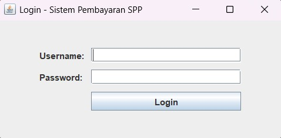
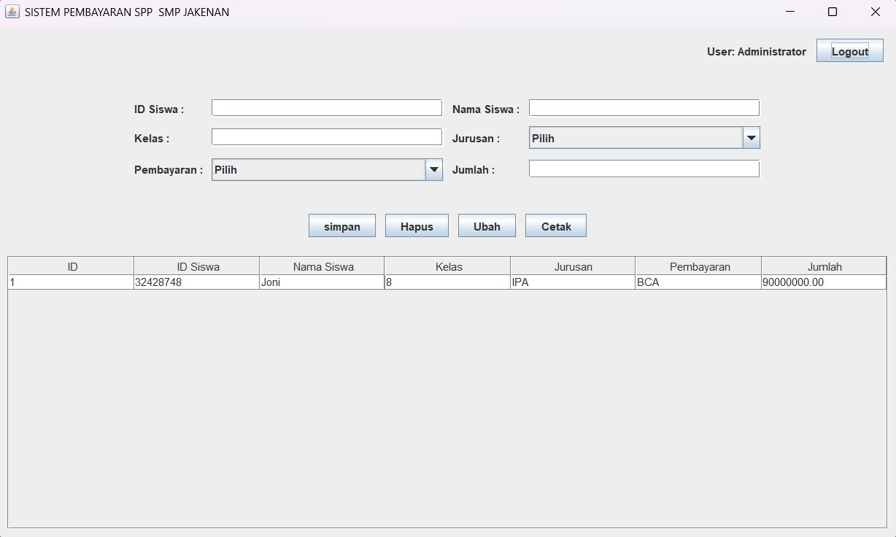
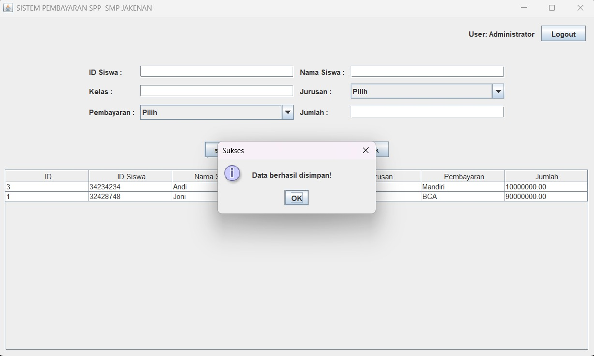
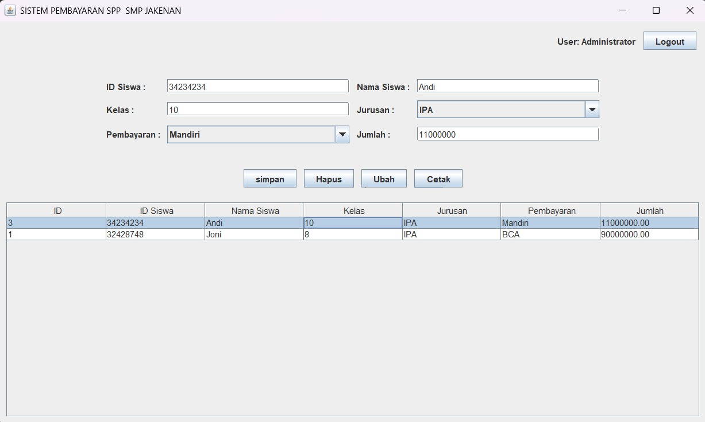
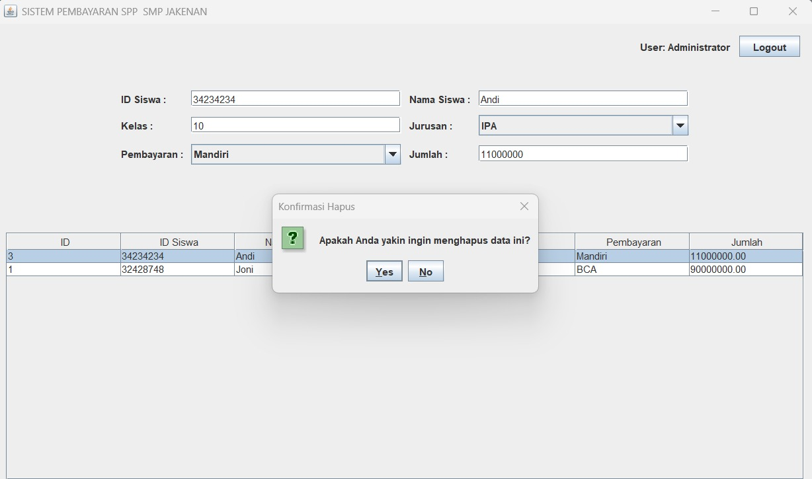
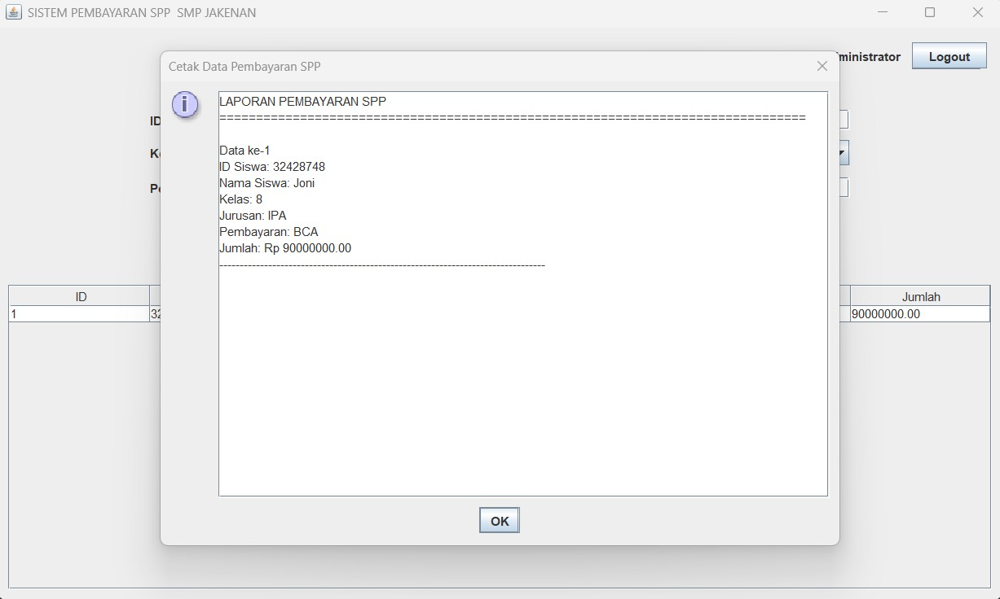

# UAS Pemrograman Berbasis Objek


> ### Personal Information
> * Nama: Jodie Soluna Manopo
> * NIM: 230401010196
> * Kelas: IF502
> * Prodi: PJJ Informatika
> * Matkul: Pemrograman Berorientasi Objek
> * Type: UAS

## CRUD JAVA Form Pembayaran SPP
Aplikasi berbasis java ini dibuat untuk memenuhi UAS PBO. Aplikasi ini merupakan aplikasi yang mencakup fitur (login,create, read, update, delete, cetak) dari sebuah Form Pembayaran SPP.

### I. Struktur Database
---
Queries
```sql
CREATE DATABASE IF NOT EXISTS dbProjectSiswa;

USE dbProjectSiswa;

CREATE TABLE IF NOT EXISTS user (
    id INT AUTO_INCREMENT PRIMARY KEY,
    username VARCHAR(50) NOT NULL UNIQUE,
    password VARCHAR(100) NOT NULL,
    nama_lengkap VARCHAR(100),
    created_at TIMESTAMP DEFAULT CURRENT_TIMESTAMP
);

CREATE TABLE IF NOT EXISTS pembayaran_spp (
    id INT AUTO_INCREMENT PRIMARY KEY,
    id_siswa VARCHAR(50) NOT NULL,
    nama_siswa VARCHAR(100) NOT NULL,
    kelas VARCHAR(20),
    jurusan VARCHAR(30),
    pembayaran VARCHAR(50),
    jumlah DECIMAL(10,2),
    created_at TIMESTAMP DEFAULT CURRENT_TIMESTAMP
);

```

### II. Alur Aplikasi
---
1. FormLogin.jar -> file utama yang akan diakses pertama kali oleh user yang berisikan tampilan untuk Control form Login.
2. FormPembayaranSPP.jar -> file view dan semua akses kontrol CRUD ketika sudah berhasil login 
2. mysql-connector-j-8.3.0.jar -> file untuk konfigurasi koneksi database (file ini menerapkan konsep reusable yang nantinya akan digunakan setiap kali kita membutuhkan koneksi database).
5. Daftar Aksi
    1. LOGIN
    2. CREATE
    3. READ
    4. UPDATE
    5. DELETE
    6. PRINT

### IV. SCREENSHOT
---
1. FormLogin.jar
    
---
2. VIEW
    
---
3. Create
    
---
4. Update
    
---
5. Delete
    
---
6. Cetak
    
---
## HOW TO USE
### 1. Restore database
---
```console
   foo@bar:~$ sudo mysql -u db_username -p db_name < setup_database.sql
```
### 2. Setup Database Config
---
```console
    foo@bar:~$ sudo nano ./DatabaseConnection.java
```
### 3. Re-compile
---
```console
    foo@bar:~$ rm -rf FormLogin.jar
    foo@bar:~$ jar cvfm FormLogin.jar MANIFEST.MF *.class
```

> **EXAMPLE**
>
> *filename* : **DatabaseConnection.java**
>
>   ```java
>    private static final String URL = "jdbc:mysql://localhost:3306/db_karyawan";
>    private static final String USER = "root";
>    private static final String PASSWORD = "";
>   ```


### 4. Run Program
---
```console
   foo@bar:~$ java -jar FormLogin.jar
```
